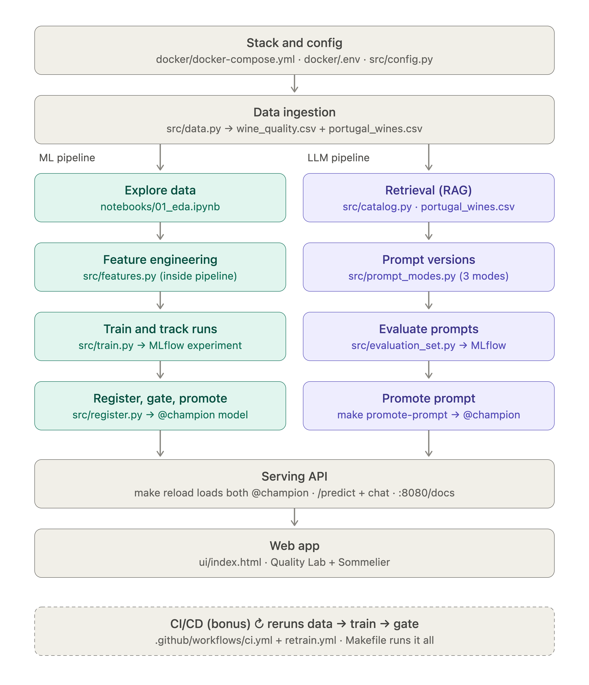

# 🍷 VinhoVerde AI

**MLOps & LLMOps mini-project, EMBAAI, Porto Business School (2026)**

VinhoVerde AI is one app with two products, both run with the same MLOps discipline:

| | 🧪 Quality Lab (MLOps) | 🍷 Sommelier (LLMOps) |
|---|---|---|
| **User** | Winemaker, before bottling | Wine-shop customer |
| **Input** | 11 lab measurements + red/white | A question in plain language |
| **Output** | Quality tier: *standard / good / premium* + recommended action | Recommendations **only from our catalog of Portuguese wines** |
| **Data** | UCI Wine Quality: red + white Vinho Verde (6.5k samples) | Kaggle Wine Reviews, filtered to Portugal (~5k wines) |
| **What we version** | The model → MLflow Model Registry | The prompt → MLflow Prompt Registry |
| **How we compare** | Macro-F1 on a held-out test set | Evaluation Set: coverage, grounding, refusals, false refusals |
| **How we ship** | Move `@champion` → `POST /reload` | Move `@champion` → `POST /prompt/reload` |

## Business value

- **Winery:** triage every batch in seconds from routine lab tests. That means fewer tasting-panel hours, and premium batches don't get sold as bulk wine (we track *premium recall*).
- **Wine shop:** a 24/7 sommelier that sells *what is actually on the shelf*, and politely refuses anything that isn't about wine.

## Team

| Member | Role | Owns in this project |
|---|---|---|
| Ivana | MLOps Engineer / Data Scientist | Model registry, `@champion` gate and promotion, versioning, CI/CD (`ci.yml`, `retrain.yml`) |
| Linda | Data Scientist / ML Engineer | Data pipeline, EDA, feature engineering, training and model metrics (macro-F1, premium recall) |
| João | Prompt Engineer / LLM Application Engineer | Sommelier prompt modes, catalog retrieval, Evaluation Set and prompt promotion |
| Olena | Software Engineer (Frontend) / UX-UI Designer | FastAPI app, UI (Quality Lab + Sommelier chat), human-AI interaction |
| Hind | Product Owner | Business goal, customer value, roadmap |

## Quick start

```bash
cp docker/.env.example docker/.env   # add GEMINI_API_KEY (+ Kaggle token, optional)
make up          # MLflow :5001 · JupyterLab :8888 · App :8080
docker compose -f docker/docker-compose.yml up -d # For everyday runs
make data        # download UCI + Kaggle, build processed tables
make train       # 4 model configurations -> MLflow
make register    # best run -> @candidate -> gate -> @champion
make promote-prompt   # score 3 prompt modes, promote the winner (~6 min)
make reload      # app picks up both champions
```

Once `make up` is running, everything is on `localhost`:

| Service | URL | What's there |
|---|---|---|
| 🍷 App | [localhost:8080](http://localhost:8080) | The UI — Quality Lab + Sommelier chat |
| 🧪 MLflow | [localhost:5001](http://localhost:5001) | Tracking, Model Registry, Prompt Registry, traces |
| 📓 JupyterLab | [localhost:8888](http://localhost:8888) | `01_eda.ipynb` and `02_pipeline_walkthrough.ipynb` |

No `make`? Every target is a one-line `docker compose` command (see `Makefile`).                        

## Architecture

```
            ┌──────────── docker compose ────────────────────────────────┐
 browser ──►│ app :8080  FastAPI + UI                                    │
            │   /predict ──► models:/VinhoVerde-Quality-Classifier@champion
            │   /chat ─────► catalog search (TF-IDF) ─► prompts:/sommelier@champion ─► Gemini
            │                                                            │
            │ mlflow :5001  tracking · model registry · prompt registry · traces
            │                                                            │
            │ jupyter :8888  EDA + runs src/data → train → register → evaluate_prompts
            └────────────────────────────────────────────────────────────┘
 GitHub Actions: ci.yml (tests on every push) · retrain.yml (bonus: scheduled retrain + gate)
```

**How `/chat` works:** the customer's question is matched against the ~5,000-wine Portuguese
catalog with a TF-IDF search (`src/catalog.py` — no vector database needed at this size). The
retrieved wines are pasted into whichever prompt template holds the `@champion` alias in the
MLflow Prompt Registry (versioned and gated the same way the model is; see
`src/evaluate_prompts.py`), and only then sent to the LLM — so it can recommend only wines the
shop actually carries, never an invented one.

In both cases, promoting a new `@champion` in MLflow + calling `/reload` or `/prompt/reload`
*is* the deployment — nothing else changes.

**Quality Lab → Sommelier handoff:** a winemaker can take a Quality Lab result (lab
measurements + predicted tier) and ask the Sommelier what style the wine likely is and what
food it pairs with. The prompt guard treats these as wine questions: lab results, quality
tiers, likely style and food pairing are all on-topic. If the measurements don't pin down an
exact style, the Sommelier explains the uncertainty instead of refusing.

### Prompt promotion gate

`make promote-prompt` scores every prompt mode on the Evaluation Set (`src/evaluation_set.py`,
9 on-topic + 4 off-topic questions, including one red and one white lab handoff). The winner
is promoted to `@champion` only if it passes all of these checks:

| Check | Threshold | Why |
|---|---|---|
| `refusal_accuracy` | = 1.0 | Answering an off-topic question is a hard fail |
| `overall_score` | ≥ 0.50 | Minimum overall answer quality |
| `false_refusal_rate` | = 0.0 | Refusing an on-topic question (e.g. a lab handoff) is also a hard fail |

In the UI, wine cards are hidden when the answer is the off-topic refusal, so a refused
question never shows unrelated catalog wines.

### Data lineage (`data_sha`)

Every model version records a fingerprint of the exact dataset it was trained on.
`file_fingerprint()` in `src/data.py` computes a SHA-256 hash of the training CSV and keeps
the first 12 characters (e.g. `a3f9c21b07de`). The same file always gives the same code;
changing a single value changes it completely.

- `src/train.py` tags every MLflow run with `data_sha` and logs the dataset with
  `mlflow.log_input` as `wine_quality_<sha>`.
- `src/register.py` copies the tag onto the registered model version, so the Model Registry
  shows which data trained each version.

**Why it matters:** if a new version scores differently, compare `data_sha`. If the tags
differ, the data changed. If they match, the code or settings changed. It also flags it if
UCI ever changes the files that the weekly `retrain.yml` job downloads.

**Limitation:** the hash shows *which* data was used, but it doesn't store it. Tools like DVC
or Delta Lake keep the actual snapshots. Here the UCI dataset is fixed and public, so a
fingerprint is enough.

 


## Repository layout

```
├── api/app.py                 FastAPI: /predict /chat /reload /prompt/reload /health
├── ui/index.html              The "lovable" UI (Quality Lab + Sommelier chat)
├── src/
│   ├── config.py              Names, features, tiers, gate threshold
│   ├── data.py                Download + clean UCI and Kaggle
│   ├── features.py            Feature engineering (inside the model pipeline)
│   ├── train.py               4 configurations → MLflow runs
│   ├── register.py            Register → gate → promote
│   ├── catalog.py             Retrieval over Portuguese wines
│   ├── prompt_modes.py        3 prompt versions (single source of truth)
│   ├── evaluation_set.py      Fixed evaluation questions
│   ├── evaluate_prompts.py    Score → register prompts → gate → promote
│   └── llm_client.py          Provider seam (Gemini via OpenAI SDK)
├── notebooks/                 01_eda · 02_pipeline_walkthrough
├── tests/                     Offline tests on synthetic data
├── docker/                    Compose stack, Dockerfiles, pinned requirements
├── .github/workflows/         ci.yml · retrain.yml
└── GUIDE.md                   Step-by-step plan to finish the project.
```

## Changelog

### Wine lab handoffs + false-refusal gate (PR #3)

Problem: the Sommelier sometimes answered a Quality Lab handoff (*"Our lab tested a red
wine… what food would pair with it?"*) with the off-topic refusal, and the UI still showed
wine cards under the refusal.

| File | Change |
|---|---|
| `src/prompt_modes.py` | Guard now lists wine lab measurements, predicted quality tiers, likely style and food pairing as on-topic; explain uncertainty instead of refusing |
| `src/evaluation_set.py` | Added the exact red and white lab handoff questions, so every prompt evaluation covers them |
| `src/evaluate_prompts.py` | New gate `MAX_FALSE_REFUSAL_RATE = 0.0`: a prompt that refuses any on-topic question can't be promoted |
| `ui/index.html` | Wine cards are not rendered when the answer is the off-topic refusal |

Result: syntax check and all 14 tests passed. In the promotion run, the `grounded` prompt
scored **0.981** overall with **0 false refusals** across the 13 evaluation questions and
was promoted to `@champion` (prompt v11). After reloading the app, both
handoffs and an off-topic question behaved as expected.

## Known limitations

- **False refusals can still be non-deterministic.** Before the gate existed, the
  `grounded` prompt refused *"A Douro red under 20 euros for steak?"* once at
  `temperature=0.4`, even though replaying the same prompt 4/4 times gave correct answers.
  The `false_refusal_rate` gate now blocks promotion of a prompt that refuses on-topic
  questions, but it only sees one sample per question. A flaky refusal can still slip past
  the eval or show up in production.
- **The UI refusal check is an exact string match.** `ui/index.html` duplicates the
  `REFUSAL` text from `src/prompt_modes.py`. If one changes and the other doesn't, wine
  cards will show again under refusals.
- **Prompt version numbers are local.** Each machine's MLflow numbers its own versions,
  so the number you see can differ. After pulling, run `make promote-prompt` and check
  that `@champion` points to the `grounded` prompt.

## Data credits

- P. Cortez et al., *Modeling wine preferences by data mining from physicochemical properties*, Decision Support Systems, 2009 (UCI Wine Quality).
- WineEnthusiast reviews, via Kaggle ([zynicide/wine-reviews](https://www.kaggle.com/datasets/zynicide/wine-reviews)).
